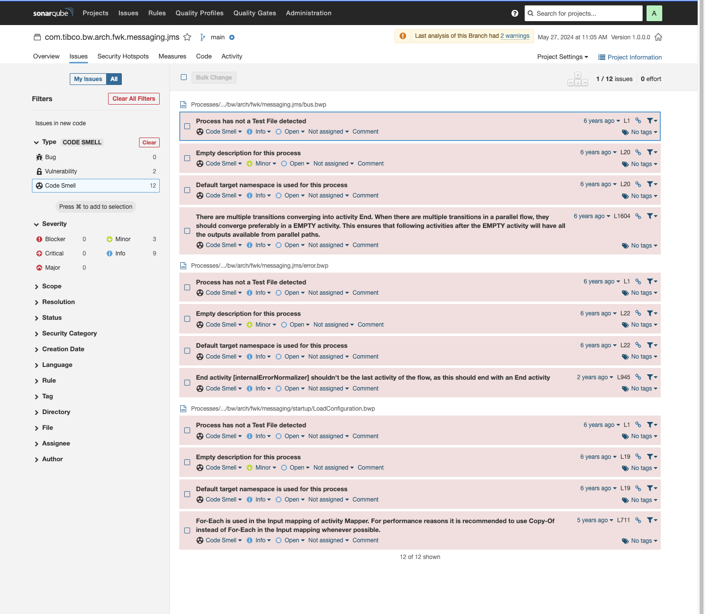

# Extension for SonarQube for use with TIBCO BusinessWorks

## Introduction

This is a TIBCO BusinessWorks Container plugin for the SonarQube, the static code analyzer tool.

This is a quality-enforcement component for TIBCO ActiveMatrix BusinessWorks 5.x, TIBCO ActiveMatrix BusinessWorks BW6.x and TIBCO BusinessWorks Container Edition 2.x  applications. The component is able to understand the details of your TIBCO BW application and then applies "rules" that detect various conditions that are either required for the application or are blocked. In this way the plugin is able to enforce a "quality" policy for TIBCO BW applications within an organization.

Each detected issue may then be tracked individually and quality gates assigned so that code that does not meet a specific quality level cannot be released:

In either event the component will usually be executed as part of a CICD build pipeline. Typically this step will be executed before attempting to compile the application and then a "gate" will be defined to only allow build and deployment to progress if the code is of adequate quality.

## Supported Rules
The component is intended to be extensible in that any of the currently defined rules may be used, or ommited as required for a given system. Additional rules may also be added as required although this will typically require Java development.
The currently supported rules and metrics for this version of the plugin are described

* TIBCO BusinessWorks 5.x Rules [here](docs/rules/bw5/RULES.md)
* TIBCO BusinessWorks 6.x / TIBCO BusinessWorks Container Edition Rules [here](docs/rules/bw6/RULES.md)

## Overriding Rules
Although typically an administrator will define which rules should be used for analysis, it is sometimes useful to allow developers to skip particular rules in a specific case if that would lead to a false alarm. In this case rules may be overridden.

## Building and Development
Building and development of the plugin is described [here](docs/BUILDING.md) and [here](docs/DEVELOPMENT.md).
In order to develop the plugin it is typically necessary to understand the object model into which the BW application is parsed. 

## Installation and configuration
Installation and configuration details are described [here](docs/INSTALLATION.md) and [here](docs/CONFIG.md)

##  Software Licenses and Third Party Usage
This software is provided subject to the terms of the following licenses and uses third party libraries describes [here](docs/third-party-licenses/third-party-report.html)