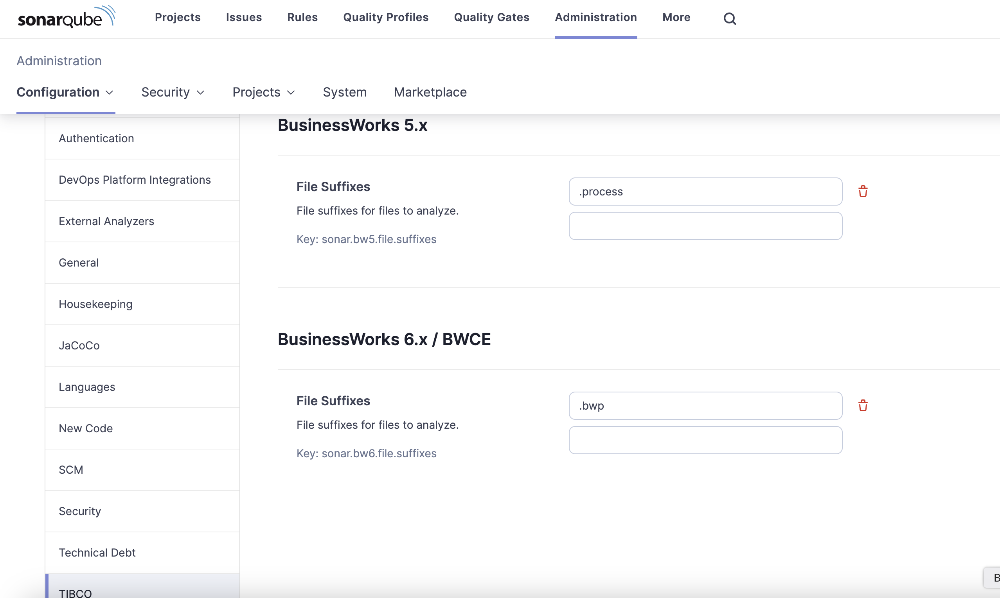

# Using the Plugin with SonarQube

In this configuration, the plugin is installed within a SonarQube system and contributes to the facilities provided by SonarQube.

The plugin is compatible with and tested on SonarQube versions 10.x

## Set up SonarQube

If you don't have a SonarQube system, you can easily create one in Docker for local testing using `docker compose`. Note that this configuration is not suitable for shared operations:

1. Save as "`docker-compose.yaml`":

```
version: "3"
services:
  sonarqube:
    image: sonarqube:10.4.1-community
    hostname: sonarqube
    container_name: sonarqube
    depends_on:
      - db
    environment:
      SONAR_JDBC_URL: jdbc:postgresql://db:5432/sonar
      SONAR_JDBC_USERNAME: sonar
      SONAR_JDBC_PASSWORD: sonar
    volumes:
      - sonarqube_data:/opt/sonarqube/data
      - sonarqube_extensions:/opt/sonarqube/extensions
      - sonarqube_logs:/opt/sonarqube/logs
    ports:
      - "9000:9000"
    networks:
      - sonarqube
  db:
    image: postgres:13
    hostname: postgresql
    container_name: sonarqube-postgresql
    environment:
      POSTGRES_USER: sonar
      POSTGRES_PASSWORD: sonar
      POSTGRES_DB: sonar
    volumes:
      - postgresql:/var/lib/postgresql
      - postgresql_data:/var/lib/postgresql/data
    networks:
      - sonarqube
volumes:
  sonarqube_data:
  sonarqube_extensions:
  sonarqube_logs:
  postgresql:
  postgresql_data:
networks:
  sonarqube:
    name: sonarqube-network
```

The default administrator user and password is "`admin`". You will be prompted to change the password on first login.

2. Install the server:

   ```
   docker compose up -d
   ```

3. Stop the server when not required:

   ```
   docker compose stop
   ```

4. Start the server if stopped:

   ```
   docker compose start
   ```

## Installation

Copy file "`target/sonar-bw6-plugin-<version>.jar`" to directory "`/opt/sonarqube/extensions/plugins`" on the SonarQube server and restart.

On a standalone system you can use the commands:

```
docker cp target/sonar-bw6-plugin-<version>.jar \
          sonarqube:/opt/sonarqube/extensions/plugins
docker restart sonarqube
```

Confirm that the plugin is installed by checking the "`Administration/Configuration`" screen and looking for a new "`TIBCO`" section:



## Using the plugin

The plugin operates just like any other SonarQube plugin. Define Quality Profiles that use the rules that you are interested in. Modify the configuration of each rule within the Quality Profile to fine-tune operation. Define Quality Gates that specify how many of each defect type should be allowed by a pipeline.

The overall operation of the plugin can be configured by an administrator using the [configuration page](./CONFIG.md) within SonarQube.

---

[<< Return to main README file](../README.md)
